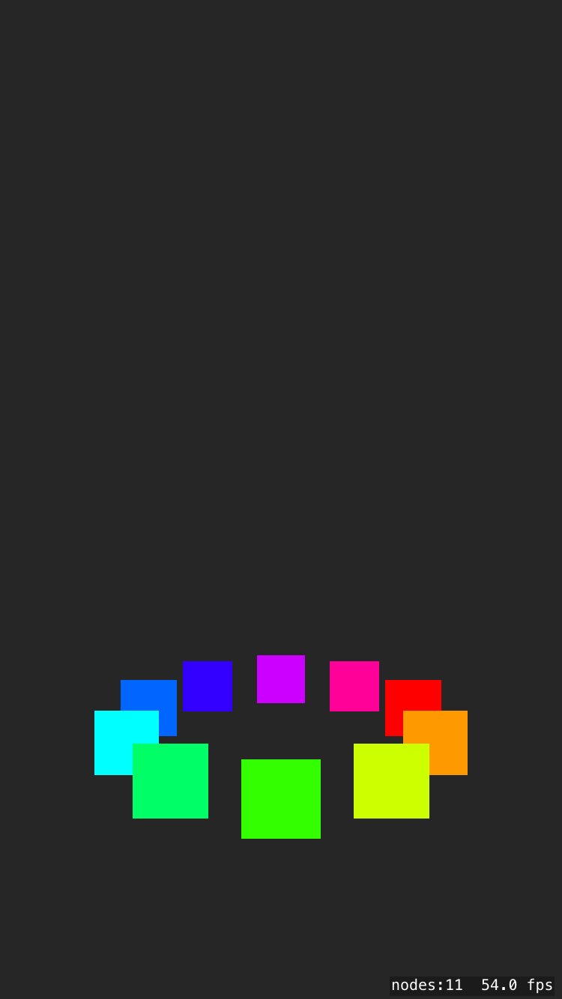

# Example-2.5D

This example creates a SKSpriteNode sublcass that renders itself with the appearance of being in 3d space. 
The system is built on the idea of setting the position, scale and zPosition of the sprite based on faux 3d coordinates. 

Use the Sprite3D class as a substitute for any SKSpriteNode. Set the x, y, z properties to position the sprite in spac. 
You must call sprite3d.render() to draw the sprite in its "3d".

